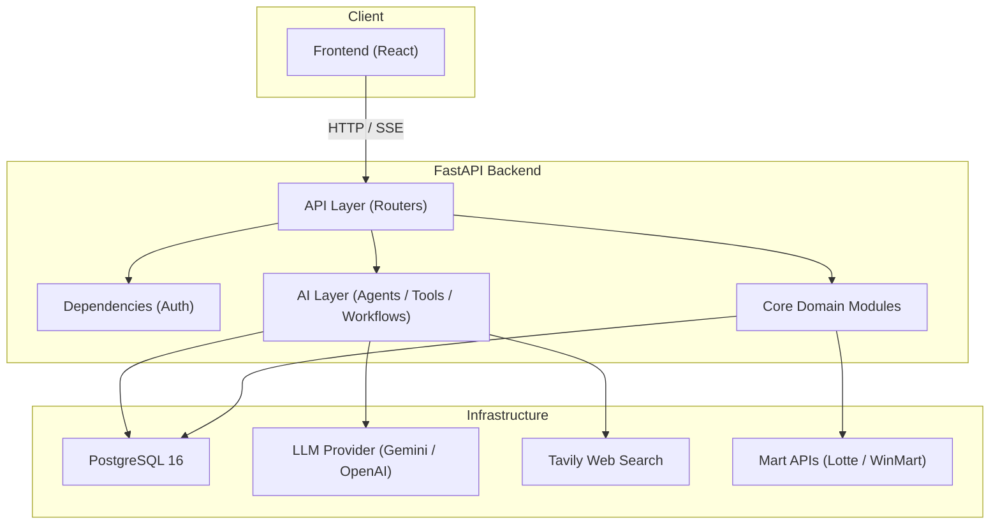

# Nutri Backend -- System Overview

## 1. Purpose

Nutri is an AI-powered nutrition assistant platform that helps users manage
household meal planning, grocery shopping, and health-aware dietary decisions.
The backend exposes a REST API consumed by a web frontend and orchestrates
multiple LLM-based agents to deliver intelligent, personalised nutrition
guidance.

## 2. Technology Stack

| Layer | Technology | Version Constraint |
|---|---|---|
| Language | Python | >= 3.12 |
| Web Framework | FastAPI | >= 0.115 |
| ORM | SQLAlchemy (async) | >= 2.0 |
| Database | PostgreSQL 16 (pgvector) | -- |
| Migrations | Alembic | >= 1.13 |
| AI Orchestration | LangGraph + LangChain | >= 0.2.6 / >= 0.3 |
| LLM Providers | Google Gemini, OpenAI-compatible (Qwen) | -- |
| Package Manager | uv (Astral) | -- |
| Containerisation | Docker | -- |
| Structured Logging | Python stdlib + rotating files | -- |

## 3. High-Level Architecture

## 4. Key Design Principles

1. **Domain-Driven Modules** -- Each business domain (auth, menus, grocery,
   onboarding, etc.) lives under `core/` with its own models, DTOs, and
   services. Routers sit under `api/routers/` and delegate to core logic.

2. **Multi-Agent AI Layer** -- AI capabilities are separated into Agents
   (stateful or stateless LLM wrappers), Tools (functions the agents can
   invoke), and Workflows (multi-step orchestrations). See
   `05-multi-agent-system.md` for detail.

3. **Async-First** -- The entire stack is asynchronous. Database sessions use
   `asyncpg`, HTTP calls use `httpx`, and long-running AI tasks are dispatched
   via `asyncio.create_task` or FastAPI `BackgroundTasks`.

4. **Draft-then-Persist Pattern** -- Meal plans are first generated as
   ephemeral draft payloads (returned to the client in the chat stream), then
   persisted only when the user explicitly confirms via `save-from-chat`.

5. **Streaming Chat** -- The primary chat endpoint (`POST /chat/stream`)
   returns a Server-Sent Events (SSE) stream. The backend spawns a background
   coroutine that drives the ReAct agent loop and pushes events (chunks, tool
   starts/ends, drafts, token usage) to the client in real time.

6. **Background Enrichment** -- After onboarding, background tasks
   automatically recompute metabolic metrics (BMR/TDEE) and enrich health
   profiles with dietary metadata via the `EnrichMetadataAgent`.

## 5. Document Index

| Document | Description |
|---|---|
| `01-project-structure.md` | Directory layout and module responsibilities |
| `02-data-model.md` | Database schema, entity relationships (ERD) |
| `03-api-reference.md` | Complete API endpoint catalogue |
| `04-authentication-and-security.md` | Auth flows, JWT, OAuth |
| `05-multi-agent-system.md` | Multi-agent architecture deep dive |
| `06-workflows.md` | End-to-end business workflow diagrams |
| `07-configuration-and-deployment.md` | Environment, Docker, CI/CD |
