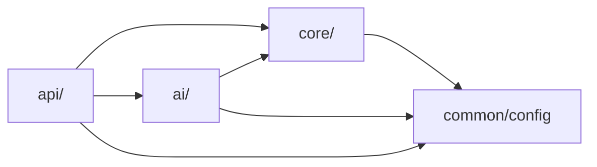

# Project Structure

This document describes the directory layout and responsibility of each module
in the Nutri backend monorepo.

## 1. Repository Root

```
backend/
  .env                        # Runtime environment variables (git-ignored)
  .env_example                # Template for new developers
  pyproject.toml              # Project metadata, dependencies, workspace config
  uv.lock                    # Deterministic lock file (uv)
  Dockerfile                 # Production container image
  docker-entrypoint.sh       # Container startup: DB init + app server
  database/
    docker-compose.yaml      # Local PostgreSQL 16 (pgvector) + pgweb
  libs/
    logger/                  # Internal workspace package (nutri-logger)
  src/
    nutri/                   # Main application package
  tests/                     # Test suite (pytest)
  logs/                      # Runtime log output (git-ignored)
```

## 2. Workspace Layout

The project uses a **uv workspace** with three member groups:

```
[tool.uv.workspace]
members = ["libs/*", "src/*", "packages/*"]
```

| Member          | Path          | Purpose                           |
| --------------- | ------------- | --------------------------------- |
| `nutri-backend` | `src/nutri`   | Main application code             |
| `nutri-logger`  | `libs/logger` | Shared structured logging library |

## 3. Source Package -- `src/nutri/`

```
src/nutri/
  pyproject.toml             # Sub-package build config
  reset_db.py                # Utility script to drop and recreate all tables

  ai/                        # AI layer (agents, tools, workflows)
    __init__.py
    checkpoint.py            # LangGraph Postgres checkpointer (singleton)
    language.py              # Language detection and normalization
    llm_client.py            # LLM factory (Gemini / OpenAI-compatible)
    system_prompt.py         # Structured system prompt builder

    agents/                  # Individual agent implementations
      __init__.py
      assistant_agent.py     # Main conversational ReAct agent (Corin)
      meal_plan_agent.py     # Structured meal plan generator
      grocery_list_agent.py  # Shopping list aggregator
      fridge_check_agent.py  # Fridge inventory deduction agent
      enrich_metadata_agent.py  # Health profile enrichment agent
      spike_predictor_agent.py  # Glucose spike risk predictor

    tools/                   # LangChain tools (callable by agents)
      __init__.py
      health_tools.py        # get_health_goals
      knowledge_tools.py     # get_diet_reference, enrich_attribute_metadata, web_search_info
      nutrition_tools.py     # predict_glucose_spike, calculate_bmr
      plan_tools.py          # create_meal_plan
      profile_tools.py       # get_user_profile
      recipe_tools.py        # perform_recipe_web_search

    workflows/               # Multi-step orchestrations
      meal_plan_workflow.py  # Draft generation + persistence pipeline
      grocery_workflow.py    # Background grocery list generation

  api/                       # HTTP API layer
    main.py                  # FastAPI app factory, CORS, middleware, router registration
    dependencies.py          # Dependency injection (get_current_user, get_optional_user)

    routers/                 # Endpoint modules
      auth.py                # Register, login, Google OAuth
      chat.py                # SSE streaming chat, session CRUD
      collections.py         # Recipe collection management
      grocery.py             # Grocery CRUD, store listing, shopping orders
      inventory.py           # Fridge inventory CRUD, bulk import
      menus.py               # Meal plan CRUD, save-from-chat
      onboarding.py          # Onboarding quiz submit + update
      profile.py             # User profile endpoints
      recipes.py             # Recipe search and CRUD
      system.py              # Health check, dashboard status, log viewer

  common/                    # Cross-cutting utilities
    config/
      settings.py            # Pydantic Settings (env-driven configuration)
      logging_config.py      # Rotating file + console logging setup

  core/                      # Domain modules (models, DTOs, services)
    auth/
      dto.py                 # UserCreate, UserDTO, AuthResponse, GoogleToken
      entities.py            # Pydantic validation models
      models.py              # User SQLAlchemy model

    chat/
      dto.py                 # ChatRequest, ChatMessageResponse, etc.
      models.py              # ChatSession, ChatMessage
      services.py            # extract_meal_plan_draft, is_meaningful_message

    collections/
      dto.py                 # Collection DTOs
      services.py            # Collection logic

    db/
      __init__.py
      session.py             # Engine, async_session_maker, Base, get_db

    grocery/
      data/                  # Static data files (store mappings)
      dto.py                 # GroceryItemDTO, ShoppingRequest, etc.
      mart_search.py         # Lotte / WinMart product search clients
      models.py              # UserInventory, GroceryItem, ShoppingOrder
      product_validator.py   # LLM-based product relevance validator
      services.py            # Utility functions
      shopping_bg.py         # Background shopping order processor
      store_mapping.py       # Store branch data loader

    inventory/
      dto.py                 # InventoryItemDTO, bulk/update requests
      services.py            # accumulate_quantities helper

    menus/
      dto.py                 # MealPlanResponse, SaveMenuFromChatRequest, etc.
      models.py              # Recipe, Ingredient, RecipeIngredient, MealPlan, Meal, RecipeCollection, CollectionRecipe
      services.py            # Meal plan query helpers, response builders

    onboarding/
      dto.py                 # OnboardingRequest, MemberResponse, etc.
      models.py              # FamilyMember
      services.py            # BMR/TDEE computation, health profile enrichment

    profile/
      dto.py                 # Profile DTOs

    recipes/
      dto.py                 # RecipeCreate, RecipeSearchResult
      entities.py            # RecipeList Pydantic model (for LLM extraction)
      models.py              # Recipe model (alternative definition)

    security/
      jwt.py                 # JWT token creation, password hashing
```

## 4. Dependency Graph



Key constraints:

- `common/` has no internal dependencies; it is a leaf module.
- `core/` depends only on `common/` and the database layer.
- `ai/` depends on `core/` (for models and DB access) and `common/`.
- `api/` is the entry point and depends on everything.

## 5. Internal Library -- `libs/logger`

A thin workspace package (`nutri-logger`) that provides structured logging
utilities. Declared as a workspace source dependency in the root
`pyproject.toml`:

```toml
[tool.uv.sources]
nutri-logger = { workspace = true }
```
