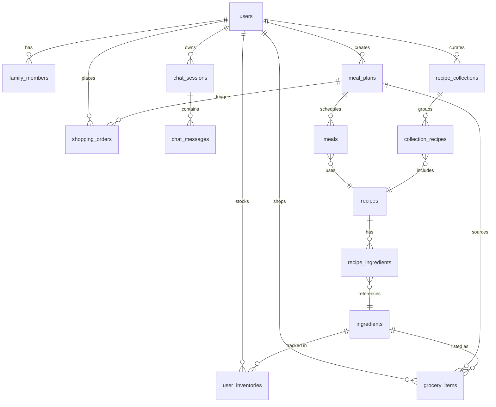

# Data Model

This document describes the relational schema, entity relationships, and key
data conventions used by the Nutri backend.

## 1. Entity Relationship Diagram



## 2. Table Definitions

### 2.1 users

The central identity table. Stores authentication credentials and user-level
preferences set during onboarding.

| Column | Type | Constraints | Description |
|---|---|---|---|
| id | UUID | PK, default uuid4 | Primary key |
| email | VARCHAR | UNIQUE, NOT NULL, INDEXED | Login identifier |
| password_hash | VARCHAR | NULLABLE | bcrypt hash (null for OAuth-only users) |
| full_name | VARCHAR | -- | Display name |
| status | VARCHAR | default "active" | Account status |
| auth_provider | VARCHAR | NULLABLE | "google" or null for email/password |
| auth_provider_id | VARCHAR | NULLABLE | Provider-specific user ID |
| diet_mode | VARCHAR | NULLABLE | "balanced", "keto", "vegetarian", etc. |
| budget_level | VARCHAR | NULLABLE | "low", "medium", "high" |
| created_at | TIMESTAMPTZ | server default now() | Registration timestamp |

Relationships: `family_members`, `chat_sessions`, `meal_plans`,
`inventories`, `grocery_items`, `shopping_orders`.

### 2.2 family_members

Stores household member profiles including biometric data, health conditions,
and metabolic metrics. Each user has at least one member (themselves, with
`relationship_type = "self"`).

| Column | Type | Constraints | Description |
|---|---|---|---|
| id | UUID | PK | -- |
| user_id | UUID | FK -> users.id, NOT NULL | Owner |
| name | VARCHAR | NOT NULL | Member name |
| relationship_type | VARCHAR | -- | "self", "spouse", "child", etc. |
| age | INTEGER | NULLABLE | Age in years |
| gender | VARCHAR | -- | "male", "female", "other" |
| weight_kg | NUMERIC | NULLABLE | Body weight |
| bmr | NUMERIC | NULLABLE | Basal Metabolic Rate (auto-computed) |
| tdee | NUMERIC | NULLABLE | Total Daily Energy Expenditure (auto-computed) |
| primary_goal | VARCHAR | -- | "lose_weight", "maintain", "gain_muscle" |
| activity_level | VARCHAR | -- | "sedentary", "light", "moderate", "active", "very_active" |
| health_profile | JSONB | default {} | Structured health data (see below) |

**health_profile JSON structure:**

```json
{
  "allergies": ["Peanut", "Shellfish"],
  "conditions": ["Diabetes", "High Blood Pressure"],
  "favorite_dishes": ["Pho", "Bun Bo Hue"],
  "height_cm": 170,
  "equipment": ["oven", "air_fryer"],
  "enriched_metadata": {
    "conditions_metadata": {
      "Diabetes": {
        "safety_level": "warning",
        "dietary_rules": ["..."],
        "foods_to_avoid": ["..."],
        "foods_to_prioritize": ["..."],
        "general_advice": "..."
      }
    },
    "allergies_metadata": { ... }
  }
}
```

The `enriched_metadata` field is populated by the `EnrichMetadataAgent`
background task after onboarding.

### 2.3 chat_sessions

Represents a conversation thread between a user and the AI assistant.

| Column | Type | Constraints | Description |
|---|---|---|---|
| id | UUID | PK | Also used as LangGraph thread_id |
| user_id | UUID | FK -> users.id, NOT NULL | Owner |
| title | VARCHAR | -- | Auto-generated from first message |
| system_prompt_used | VARCHAR | -- | Reserved for prompt versioning |
| created_at | TIMESTAMPTZ | server default now() | -- |
| updated_at | TIMESTAMPTZ | server default now() | Updated on new messages |

### 2.4 chat_messages

Individual messages within a chat session. Stores both human and AI messages,
including tool call metadata.

| Column | Type | Constraints | Description |
|---|---|---|---|
| id | UUID | PK | -- |
| session_id | UUID | FK -> chat_sessions.id, NOT NULL | Parent session |
| message_type | VARCHAR | NOT NULL | "human", "ai", or "tool" |
| content | TEXT | -- | Message text content |
| tool_calls | JSONB | default [] | Array of tool call records |
| token_usage | INTEGER | -- | Total tokens consumed |
| is_read | BOOLEAN | default true | Unread indicator for AI messages |
| created_at | TIMESTAMPTZ | server default now() | -- |

The `tool_calls` JSONB column is also used to store `meal_plan_draft` data
when a meal plan is generated in chat, enabling the save-from-chat workflow.

### 2.5 recipes

Stores recipe definitions, either AI-generated or web-scraped.

| Column | Type | Constraints | Description |
|---|---|---|---|
| id | UUID | PK | -- |
| name | VARCHAR | NOT NULL | Recipe name |
| description | TEXT | -- | Brief description |
| instructions | TEXT | -- | Cooking steps (newline-separated) |
| prep_time_minutes | INTEGER | -- | -- |
| cook_time_minutes | INTEGER | -- | -- |
| total_calories | INTEGER | -- | Per-serving calories |
| type | VARCHAR | -- | "Vegetarian", "Meat", etc. |
| image_url | VARCHAR | -- | -- |
| source_url | VARCHAR | -- | Origin URL if web-scraped |
| macros | JSONB | default {} | `{"protein": N, "carbs": N, "fat": N, "fiber": N}` |
| dietary_tags | JSONB | default [] | `["gluten-free", "low-carb"]` |

### 2.6 ingredients

Normalised ingredient catalogue shared across all recipes and users.

| Column | Type | Constraints | Description |
|---|---|---|---|
| id | UUID | PK | -- |
| name | VARCHAR | NOT NULL | Canonical ingredient name |
| category | VARCHAR | -- | Supermarket aisle ("Produce", "Dairy", etc.) |
| base_unit | VARCHAR | -- | Reserved for unit standardisation |

### 2.7 recipe_ingredients

Join table linking recipes to ingredients with quantities.

| Column | Type | Constraints | Description |
|---|---|---|---|
| id | UUID | PK | -- |
| recipe_id | UUID | FK -> recipes.id, NOT NULL | -- |
| ingredient_id | UUID | FK -> ingredients.id, NOT NULL | -- |
| quantity | NUMERIC | -- | Quantity in grams |

### 2.8 meal_plans

A meal plan groups multiple meals across one or more days.

| Column | Type | Constraints | Description |
|---|---|---|---|
| id | UUID | PK | -- |
| user_id | UUID | FK -> users.id, NOT NULL | Owner |
| name | VARCHAR | -- | "Menu Mar 29" |
| start_date | DATE | -- | First day of the plan |
| end_date | DATE | -- | Last day of the plan |
| status | VARCHAR | -- | "generating", "completed" |
| custom_prompt | TEXT | -- | User's custom instructions |
| ai_context_summary | JSONB | default {} | Profile snapshot used for generation |
| created_at | TIMESTAMPTZ | server default now() | -- |

### 2.9 meals

Individual meal entries within a meal plan.

| Column | Type | Constraints | Description |
|---|---|---|---|
| id | UUID | PK | -- |
| meal_plan_id | UUID | FK -> meal_plans.id, NOT NULL | Parent plan |
| recipe_id | UUID | FK -> recipes.id, NOT NULL | Associated recipe |
| eat_date | DATE | -- | Scheduled date |
| meal_type | VARCHAR | -- | "breakfast", "lunch", "dinner", "snack" |
| servings | INTEGER | -- | Number of servings |
| adjusted_instructions | TEXT | -- | Per-meal customisation |

### 2.10 user_inventories

Tracks what the user currently has in their fridge/pantry.

| Column | Type | Constraints | Description |
|---|---|---|---|
| id | UUID | PK | -- |
| user_id | UUID | FK -> users.id, NOT NULL | Owner |
| ingredient_id | UUID | FK -> ingredients.id, NOT NULL | What ingredient |
| quantity | VARCHAR | -- | Free-text quantity (e.g. "500g", "2 bottles") |
| expiration_date | DATE | -- | -- |
| updated_at | TIMESTAMPTZ | on update now() | -- |

### 2.11 grocery_items

Shopping list items derived from a meal plan.

| Column | Type | Constraints | Description |
|---|---|---|---|
| id | UUID | PK | -- |
| user_id | UUID | FK -> users.id, NOT NULL | Owner |
| meal_plan_id | UUID | FK -> meal_plans.id, NULLABLE | Source plan |
| ingredient_id | UUID | FK -> ingredients.id, NOT NULL | What to buy |
| quantity | NUMERIC | -- | Amount in grams |
| is_purchased | BOOLEAN | default false | Check-off state |

### 2.12 shopping_orders

Records requests to search online marts for grocery items.

| Column | Type | Constraints | Description |
|---|---|---|---|
| id | UUID | PK | -- |
| user_id | UUID | FK -> users.id, NOT NULL | -- |
| meal_plan_id | UUID | FK -> meal_plans.id, NULLABLE | -- |
| total_amount | NUMERIC | -- | Estimated total cost |
| currency | VARCHAR | -- | -- |
| status | VARCHAR | -- | "processing", "completed", "failed" |
| strategy | VARCHAR | -- | "lotte_priority", "winmart_priority", "cost_optimized" |
| city | VARCHAR | NULLABLE | -- |
| result_data | JSONB | NULLABLE | Full search results payload |
| notification_read | BOOLEAN | default false | UI notification state |
| ordered_at | TIMESTAMPTZ | server default now() | -- |

### 2.13 recipe_collections and collection_recipes

User-curated recipe bookmarks.

**recipe_collections:**

| Column | Type | Description |
|---|---|---|
| id | UUID | PK |
| user_id | UUID | FK -> users.id |
| name | VARCHAR | Collection name |
| is_default | BOOLEAN | Whether this is the default collection |
| created_at | TIMESTAMPTZ | -- |

**collection_recipes:**

| Column | Type | Description |
|---|---|---|
| id | UUID | PK |
| collection_id | UUID | FK -> recipe_collections.id |
| recipe_id | UUID | FK -> recipes.id |
| added_at | TIMESTAMPTZ | -- |

### 2.14 LangGraph Checkpoint Tables

These tables are auto-created by the `AsyncPostgresSaver` checkpointer during
application startup. They store LangGraph conversation state, enabling
stateful multi-turn agent interactions.

**checkpoints:**

Stores serialised graph state snapshots per thread.

| Column                | Type    | Constraints | Description                         |
| --------------------- | ------- | ----------- | ----------------------------------- |
| thread_id             | VARCHAR | PK (composite) | Maps to chat_sessions.id         |
| checkpoint_ns         | VARCHAR | PK (composite) | Namespace for nested graphs      |
| checkpoint_id         | VARCHAR | PK (composite) | Unique checkpoint identifier     |
| parent_checkpoint_id  | VARCHAR | NULLABLE    | Previous checkpoint in the chain    |
| type                  | VARCHAR | --          | Serialisation format                |
| checkpoint            | BYTEA   | --          | Serialised graph state              |
| metadata              | JSONB   | --          | Step metadata (writes, source, etc) |

**checkpoint_blobs:**

Stores large binary channel values separately from the main checkpoint.

| Column        | Type    | Constraints    | Description                  |
| ------------- | ------- | -------------- | ---------------------------- |
| thread_id     | VARCHAR | PK (composite) | Parent thread                |
| checkpoint_ns | VARCHAR | PK (composite) | Namespace                    |
| channel       | VARCHAR | PK (composite) | Channel name                 |
| version       | VARCHAR | PK (composite) | Blob version                 |
| type          | VARCHAR | --             | Serialisation format         |
| blob          | BYTEA   | --             | Serialised channel value     |

**checkpoint_writes:**

Stores pending writes for in-progress checkpoints (used for resumption).

| Column        | Type    | Constraints    | Description                |
| ------------- | ------- | -------------- | -------------------------- |
| thread_id     | VARCHAR | PK (composite) | Parent thread              |
| checkpoint_ns | VARCHAR | PK (composite) | Namespace                  |
| checkpoint_id | VARCHAR | PK (composite) | Target checkpoint          |
| task_id       | VARCHAR | PK (composite) | Task identifier            |
| idx           | INTEGER | PK (composite) | Write index within task    |
| channel       | VARCHAR | --             | Channel name               |
| type          | VARCHAR | --             | Serialisation format       |
| blob          | BYTEA   | --             | Serialised write value     |
| task_path     | VARCHAR | --             | Hierarchical task path     |

**checkpoint_migrations:**

Tracks the schema version of the checkpoint tables.

| Column | Type    | Description        |
| ------ | ------- | ------------------ |
| v      | INTEGER | Schema version     |

## 3. Conventions

- **Primary keys**: All application tables use UUID v4 primary keys generated
  at the application level. Checkpoint tables use composite string keys
  managed by LangGraph.
- **Timestamps**: `created_at` uses `server_default=func.now()`.
  `updated_at` uses `server_onupdate` where applicable.
- **JSON columns**: Health profiles, macros, dietary tags, tool calls, and
  shopping results are stored as JSONB for schema flexibility.
- **Soft state**: The `status` column on `meal_plans` and `shopping_orders`
  tracks lifecycle state without soft-delete semantics.
- **No Alembic migrations checked in**: Tables are currently created via
  `Base.metadata.create_all` at application startup. Checkpoint tables are
  created by `checkpointer.setup()`. Migration scripts should be added before
  production hardening.
