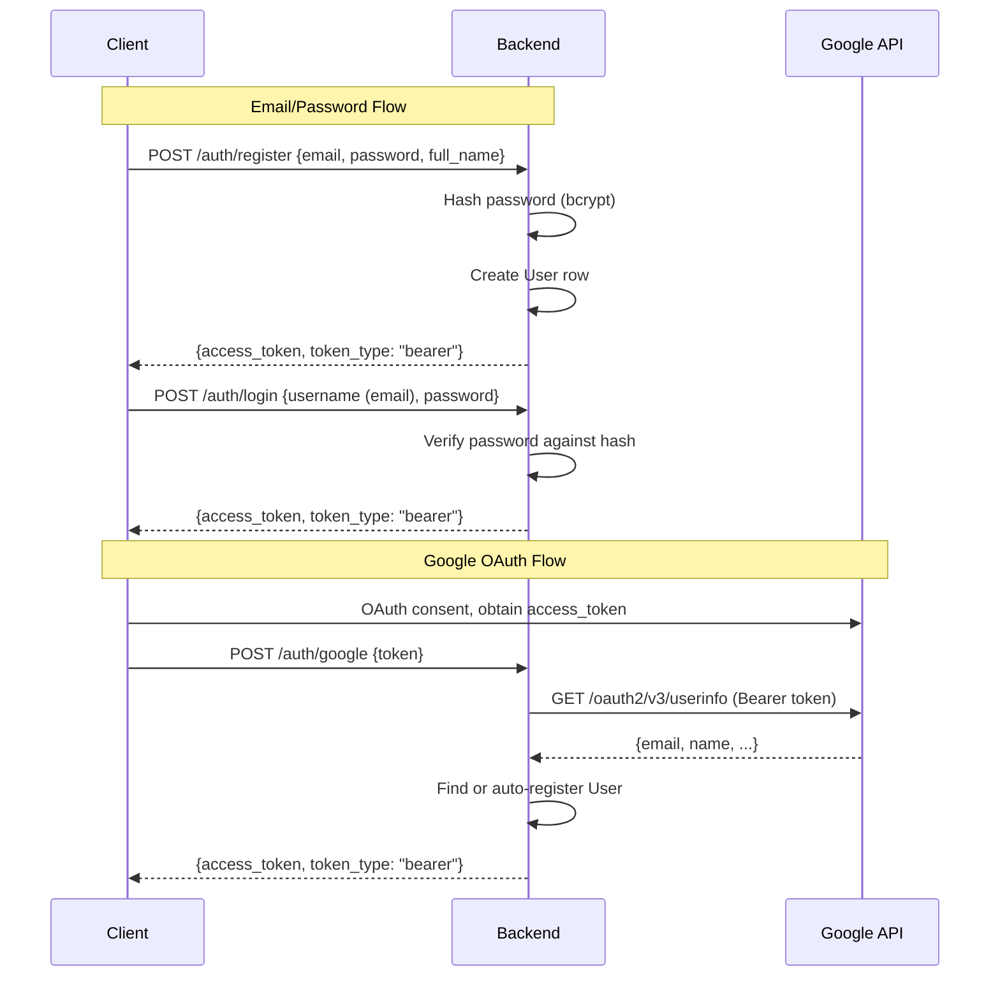

# Authentication and Security

## 1. Overview

The Nutri backend supports two authentication methods:

1. **Email/Password** -- traditional registration with bcrypt-hashed passwords
   and JWT access tokens.
2. **Google OAuth 2.0** -- token exchange flow where the frontend obtains a
   Google access token and the backend verifies it, auto-registering new users.

All authenticated endpoints use Bearer JWT tokens transmitted via the
`Authorization` header.

## 2. Authentication Flow



## 3. JWT Token Structure

Tokens are created by `core/security/jwt.py`:

- **Algorithm**: HS256
- **Secret**: `settings.SECRET_KEY` (environment variable)
- **Expiry**: `settings.ACCESS_TOKEN_EXPIRE_MINUTES` (default: 1440 = 24 hours)
- **Claims**:
  - `sub`: user email (string)
  - `exp`: expiration timestamp (UTC)

```python
def create_access_token(subject, expires_delta=None) -> str:
    to_encode = {"exp": expire, "sub": str(subject)}
    return jwt.encode(to_encode, settings.SECRET_KEY, algorithm="HS256")
```

## 4. Password Security

- **Hashing**: `passlib` with bcrypt scheme
- **Stored as**: `password_hash` column on `users` table
- **Google users**: Assigned a random 16-character password (never used for
  login; serves as a placeholder since the column is nullable)

```python
pwd_context = CryptContext(schemes=["bcrypt"], deprecated="auto")
```

## 5. Dependency Injection

Two authentication dependencies are available for route handlers:

### get_current_user (strict)

Returns the authenticated `User` object or raises `401 Unauthorized`.

```python
async def get_current_user(
    db: AsyncSession = Depends(get_db),
    token: str = Depends(oauth2_scheme)
) -> User:
```

Flow:
1. Extract Bearer token from `Authorization` header.
2. Decode JWT, extract `sub` claim (email).
3. Query `users` table by email.
4. Return `User` or raise `HTTPException(401)`.

### get_optional_user (lenient)

Returns `User | None`. Does not raise on missing or invalid tokens. Used for
endpoints that support both authenticated and anonymous access.

```python
async def get_optional_user(
    db: AsyncSession = Depends(get_db),
    token: Optional[str] = Depends(
        OAuth2PasswordBearer(tokenUrl="...", auto_error=False)
    )
) -> Optional[User]:
```

## 6. CORS Configuration

CORS is configured in `api/main.py` with permissive defaults for development:

```python
app.add_middleware(
    CORSMiddleware,
    allow_origins=["*"],          # Restrict in production
    allow_credentials=True,
    allow_methods=["*"],
    allow_headers=["*"],
)
```

**Production hardening**: Replace `allow_origins=["*"]` with the specific
frontend domain.

## 7. Request Logging Middleware

A custom HTTP middleware logs every request/response with:
- HTTP method and path
- Client IP (extracted from `X-Forwarded-For` or direct connection)
- Response status code
- Elapsed time in milliseconds

This provides an audit trail for all API calls.

## 8. Security Considerations

| Area | Current State | Recommendation |
|---|---|---|
| Token storage | JWT in memory (client-side) | Consider httpOnly cookies for XSS protection |
| Token refresh | Not implemented | Add refresh token rotation |
| Rate limiting | Not implemented | Add per-IP and per-user rate limits |
| CORS origins | Wildcard `*` | Restrict to frontend domain in production |
| Admin role | Not implemented | Add role-based access for `/system/logs` |
| Secret key | Env variable | Use a secrets manager in production |
