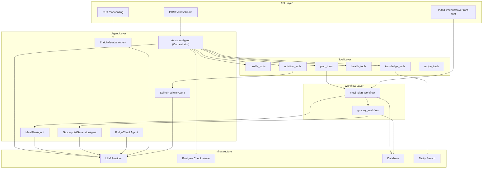
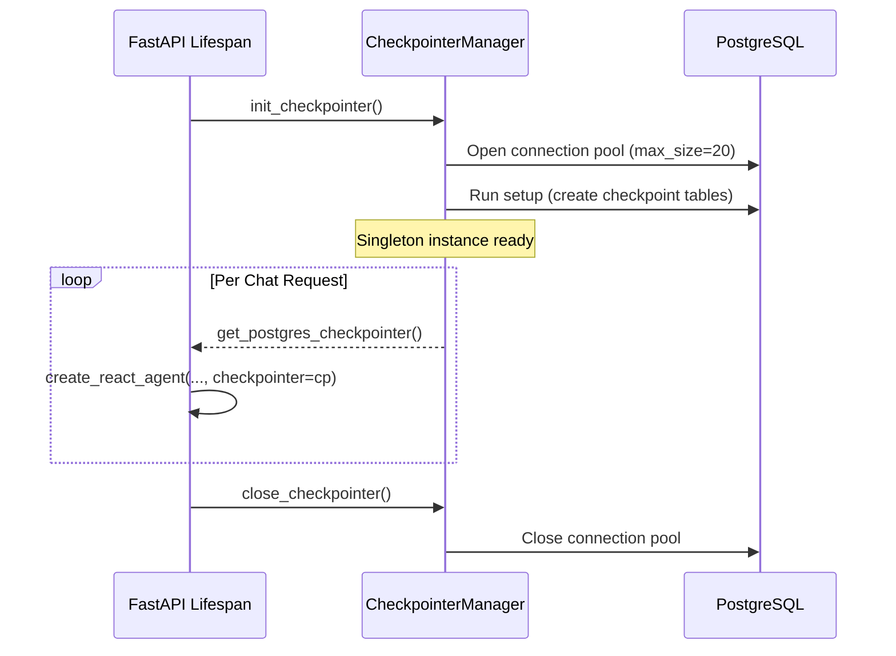
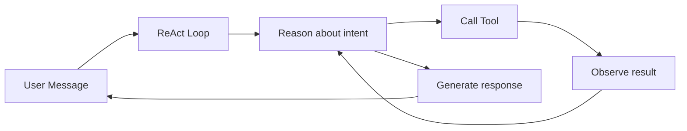
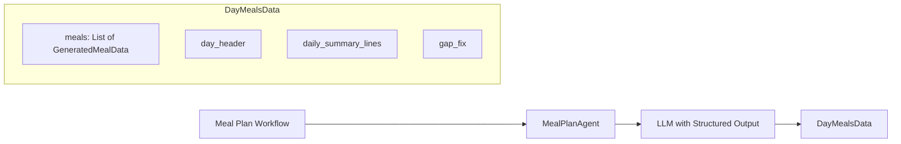
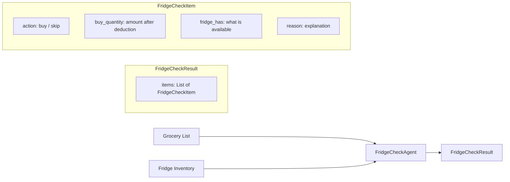
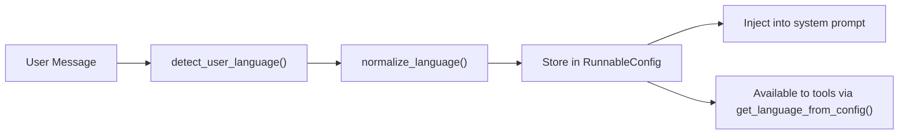
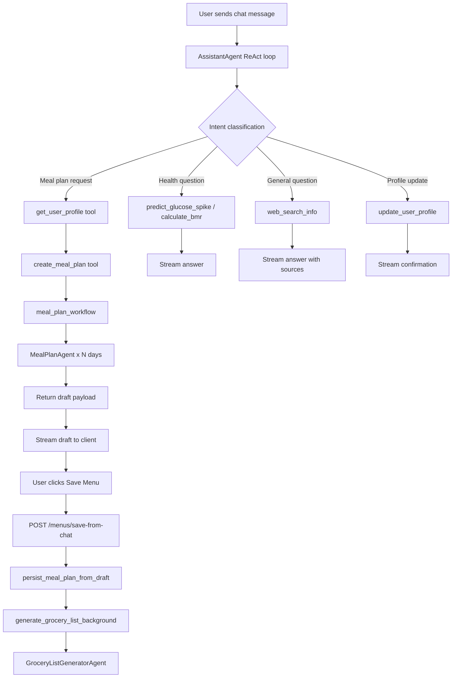

# Multi-Agent System

This document provides a comprehensive technical reference for the multi-agent
AI system that powers the Nutri backend. It covers the agent architecture,
individual agent responsibilities, tool definitions, the LLM abstraction
layer, prompt engineering patterns, and conversation state management.

## 1. Architecture Overview

The AI system follows a layered architecture with three distinct component
types:



### Component Types

| Type | Description | Stateful | Examples |
|---|---|---|---|
| **Agent** | LLM-powered decision maker with defined input/output schemas | Varies | AssistantAgent (stateful), MealPlanAgent (stateless) |
| **Tool** | Deterministic or LLM-backed function callable by agents | No | `get_user_profile`, `calculate_bmr` |
| **Workflow** | Multi-step orchestration pipeline composing agents and DB operations | No | `meal_plan_workflow`, `grocery_workflow` |

## 2. LLM Abstraction Layer

### 2.1 Provider Factory

`ai/llm_client.py` provides a factory function that returns a LangChain chat
model based on the configured provider:

```python
def get_llm(
    provider: str = settings.LLM_PROVIDER,    # "gemini" or "openai"
    model_name: str = settings.MODEL_NAME,
    temperature: float = settings.TEMPERATURE,
) -> Union[ChatGoogleGenerativeAI, ChatOpenAI]:
```

| Provider | Implementation | Default Model | Notes |
|---|---|---|---|
| `gemini` | `ChatGoogleGenerativeAI` | `gemini-2.5-flash` | Uses `GEMINI_API_KEY` and `GEMINI_API_ENDPOINT` |
| `openai` | `ChatOpenAI` | `qwen3-vl-plus` | OpenAI-compatible endpoint (e.g. self-hosted Qwen) |

All agents call `get_llm()` without hard-coding provider details, enabling
seamless model swapping via environment variables.

### 2.2 Temperature Strategy

| Agent | Temperature | Rationale |
|---|---|---|
| AssistantAgent | 0.2 | Deterministic tool selection for action-oriented requests |
| MealPlanAgent | 0.5 (default) | Creative variety in meal suggestions |
| GroceryListAgent | 0.5 (default) | Balanced aggregation |
| FridgeCheckAgent | 0.5 (default) | Balanced fuzzy matching |
| SpikePredictorAgent | 0.5 (default) | Balanced analysis |
| Recipe extraction | 0.1 | Precise structured extraction from web content |

### 2.3 Structured Output

Most agents use LangChain's `.with_structured_output(PydanticModel)` to
enforce typed responses:

```python
self.llm = get_llm().with_structured_output(DayMealsData)
```

This eliminates manual JSON parsing and provides automatic retry on parse
failures.

## 3. Conversation State Management

### 3.1 LangGraph Checkpointer

The `AssistantAgent` uses LangGraph's `AsyncPostgresSaver` to persist
conversation state across turns. This is managed as a singleton:



Key implementation details:
- Connection pool: `AsyncConnectionPool` with max 20 connections.
- Autocommit mode with `prepare_threshold=0` for compatibility.
- Initialised during FastAPI lifespan startup, closed on shutdown.
- Thread ID maps directly to `chat_sessions.id`.

### 3.2 Thread ID Mapping

The `thread_id` used by LangGraph maps 1:1 to the `ChatSession.id` UUID.
When a chat request arrives without a `thread_id`, a new UUID is generated
and a new `ChatSession` row is created.

## 4. Agent Catalogue

### 4.1 AssistantAgent (Orchestrator)

**Location**: `ai/agents/assistant_agent.py`

The primary conversational agent. Uses LangGraph's `create_react_agent`
(ReAct pattern) to autonomously decide which tools to call based on user
input.



**Characteristics:**
- **Stateful**: Conversation history persisted via Postgres checkpointer.
- **Streaming**: Emits events via `astream_events` (v2 protocol).
- **Language-aware**: Detects user language per message and responds
  accordingly.
- **Timezone-aware**: Includes user timezone in system prompt for
  time-sensitive requests.

**Registered Tools:**

| Tool | Purpose |
|---|---|
| `get_user_profile` | Retrieve user and family member profiles |
| `update_user_profile` | Add allergies, conditions, goals |
| `predict_glucose_spike` | Assess food glucose impact |
| `calculate_bmr` | Compute Basal Metabolic Rate |
| `create_meal_plan` | Trigger meal plan generation workflow |
| `get_health_goals` | Retrieve family health goals |
| `get_diet_reference` | Query dietary knowledge base |
| `enrich_attribute_metadata` | Enrich condition/allergy metadata |
| `web_search_info` | General web search (Tavily) |

**System Prompt Architecture:**

The system prompt is constructed dynamically and includes:
1. Identity and language directives.
2. Core behavior rules (act immediately, no confirmation-only replies).
3. Non-negotiable execution contract (must call tools in same turn).
4. Domain-specific rules (BMR calculation format, meal plan workflow).
5. Tool-chaining reliability rules.
6. Out-of-domain handling strategy.

**Streaming Event Processing:**

The `chat_stream` method processes LangGraph events and yields structured
payloads:

```
on_chat_model_stream  --> yield {"type": "chunk", "content": "..."}
on_tool_start         --> yield {"type": "tool_start", "name": "..."}
on_tool_end           --> yield {"type": "tool_end", ...}
                          (extract meal_plan_draft if tool is create_meal_plan)
on_chat_model_end     --> yield {"type": "token_usage", ...}
```

Tool call chunks are filtered out from the text stream to avoid leaking
raw JSON arguments to the user.

### 4.2 MealPlanAgent

**Location**: `ai/agents/meal_plan_agent.py`

A stateless agent that generates structured meal plans for individual days.
Called in a loop by the meal plan workflow to build multi-day plans.

**Input**: User profile context, day number, total days, previous days context,
custom prompt.

**Output**: `DayMealsData` (Pydantic model).



**Retry Strategy:**
- Up to 5 retries on parse failures (`OutputParserException`).
- First attempt uses a rich prompt; retries use a stricter fallback prompt
  that demands schema-only output.
- Transient LLM errors (500, rate limit, timeout) trigger exponential
  backoff retries.

**Data Model -- GeneratedMealData:**

```
name, description, meal_type, cuisine
calories, protein_grams, carbs_grams, fat_grams, fiber_grams
ingredients: List[str]
instructions: List[str]
per_person_breakdown: List[str]
adjustment_tips: List[str]
why: str (rationale)
prep_time_minutes, cook_time_minutes, servings
dietary_tags: List[str]
glycemic_index_estimate, glucose_impact_notes
```

The model includes extensive `field_validator` and `model_validator` logic to
normalise field aliases returned by different LLM models (e.g. `carb_grams`
mapped to `carbs_grams`, `steps` mapped to `instructions`).

### 4.3 GroceryListGeneratorAgent

**Location**: `ai/agents/grocery_list_agent.py`

Aggregates raw ingredient lists from meal plans into a categorised, deduplicated
shopping list.

**Input**: Raw ingredient text extracted from persisted recipes.

**Output**: `GroceryListData` containing `List[GroceryItemData]`.

Key behaviors:
- Detects ingredient language and responds in the same language.
- Combines identical items and sums quantities.
- Groups items into supermarket aisle categories.
- Preserves original ingredient names (no translation).
- Mandatory spice/seasoning grouping for common pantry items.

### 4.4 FridgeCheckAgent

**Location**: `ai/agents/fridge_check_agent.py`

Compares a grocery shopping list against the user's fridge inventory and
decides what still needs to be purchased.

**Input**: `grocery_items` (list of dicts), `inventory_items` (list of dicts).

**Output**: `FridgeCheckResult` with per-item `buy`/`skip` decisions.



Key behaviors:
- **Short-circuit**: If inventory is empty, returns `buy` for all items
  without calling the LLM.
- **Fuzzy name matching**: "Beef" matches "Australian Beef", "Lemon" matches
  "Fresh Lemon".
- **Unit conversion**: Handles kg/g, L/mL conversions.
- **Partial deduction**: If fridge has some but not enough, calculates the
  delta.
- **Output validation**: Pads or trims results to match input length.
- **Fallback**: On LLM failure, defaults to buying everything.

### 4.5 EnrichMetadataAgent

**Location**: `ai/agents/enrich_metadata_agent.py`

A background-only agent that researches health conditions and allergies to
generate structured dietary metadata.

**Invocation**: Triggered as an `asyncio.create_task` after onboarding
submit/update. Not exposed via chat tools directly.

**Output per condition**: `AttributeMetadata`:
```
safety_level: "critical" | "warning" | "info"
dietary_rules: List[str]
foods_to_avoid: List[str]
foods_to_prioritize: List[str]
general_advice: str
```

**Concurrency**: All conditions and allergies for a member are enriched
concurrently via `asyncio.gather`.

**Idempotency**: Skips enrichment if `enriched_metadata` already exists with
the same conditions and allergies.

### 4.6 SpikePredictorAgent

**Location**: `ai/agents/spike_predictor_agent.py`

A stateless, synchronous agent that predicts glucose spike risk for specific
foods.

**Input**: Food description string.

**Output**: `SpikePredictionData`:
```
food, risk_level ("low"/"medium"/"high"), estimated_gl,
explanation, smart_fix, spike_reduction_percentage
```

Called by the `predict_glucose_spike` tool, which is available to the
AssistantAgent.

## 5. Tool Catalogue

Tools are LangChain `@tool`-decorated functions that the AssistantAgent can
invoke during reasoning. Each tool receives a `RunnableConfig` parameter
providing `user_id` and `language` from the conversation context.

| Tool | Module | Async | Description |
|---|---|---|---|
| `get_user_profile` | profile_tools | Yes | Query User + FamilyMember data |
| `update_user_profile` | profile_tools | Yes | Append allergy/condition to health_profile JSON |
| `calculate_bmr` | nutrition_tools | No | Harris-Benedict BMR formula |
| `predict_glucose_spike` | nutrition_tools | No | Delegates to SpikePredictorAgent |
| `create_meal_plan` | plan_tools | Yes | Builds metabolic context and invokes meal_plan_workflow |
| `get_health_goals` | health_tools | Yes | Returns BMR/TDEE/goals per family member |
| `get_diet_reference` | knowledge_tools | No | LLM-generated dietary reference guide |
| `enrich_attribute_metadata` | knowledge_tools | No | Delegates to EnrichMetadataAgent |
| `web_search_info` | knowledge_tools | No | Tavily web search with formatted results |
| `perform_recipe_web_search` | recipe_tools | Yes | Tavily search + LLM recipe extraction |

### Tool Context Propagation

Tools receive user context through LangGraph's `RunnableConfig`:

```python
@tool
async def get_user_profile(section: str = "all", *, config: RunnableConfig):
    user_id = config.get("configurable", {}).get("user_id")
    language = get_language_from_config(config)
```

The config is populated when the chat stream starts:

```python
config = {
    "configurable": {
        "thread_id": thread_id,
        "user_id": self.user_id,
        "language": detected_language,
    }
}
```

## 6. Prompt Engineering

### 6.1 SystemPrompt Builder

`ai/system_prompt.py` provides a structured prompt builder:

```python
class SystemPrompt:
    def __init__(self, background, context, steps, output, tools_usage):
        ...
    def __str__(self) -> str:
        # Renders sections: IDENTITY AND PURPOSE, CONTEXT,
        # INTERNAL ASSISTANT STEPS, OUTPUT INSTRUCTIONS, TOOLS USAGE RULES
```

This is used by stateless agents (MealPlanAgent, GroceryListAgent, etc.) to
construct consistent, well-structured prompts.

### 6.2 AssistantAgent Prompt

The orchestrator uses a manually composed prompt with the following sections:

1. **IDENTITY** -- Defines the assistant persona ("Corin"), language and
   timezone.
2. **CORE BEHAVIOR** -- Act immediately, never confirmation-only replies.
3. **NON-NEGOTIABLE EXECUTION CONTRACT** -- Tools must be called in the same
   turn as the request.
4. **RULES** -- Domain-specific instructions:
   - BMR calculation display format (table with TDEE multipliers).
   - Meal plan workflow (get_user_profile then create_meal_plan).
   - Tool-chaining reliability.
   - Out-of-domain handling (disclaim then web search).
5. **DECISION FLOW** -- Branching logic tree for request routing.

### 6.3 Language Handling



Language detection uses `langdetect` with a deterministic seed. The detected
language code is:
1. Injected into the system prompt so the LLM responds in the correct language.
2. Propagated to tools so tool outputs include language directives.
3. Used for non-meaningful message fallback responses.

## 7. Error Handling and Resilience

### 7.1 Chat Stream Retries

The chat router implements a two-attempt retry strategy:

| Error Type | Detection | Recovery |
|---|---|---|
| Invalid chat history | `"do not have a corresponding ToolMessage"` | New thread ID (`{id}-recovery-{uuid}`) |
| Output parse failure | `OutputParserException` or validation errors | Same retry with fresh thread |

On retry, the client receives a `retrying` SSE event, and all partial state
(replies, tools, drafts) is reset.

### 7.2 Meal Plan Generation Retries

The `MealPlanAgent` implements its own retry loop:

1. First attempt: Rich prompt with detailed instructions.
2. Retries: Strict fallback prompt demanding schema-only output.
3. Transient LLM errors: Exponential backoff (0.8s per attempt, max 2s).
4. Max retries: 5 (configurable).

### 7.3 Agent Fallbacks

| Agent | Failure Behavior |
|---|---|
| FridgeCheckAgent | Returns `buy` for all items |
| EnrichMetadataAgent | Returns empty `AttributeMetadata` with error message |
| GroceryListAgent | Propagates exception (handled by workflow) |
| SpikePredictorAgent | Propagates exception (handled by tool) |

## 8. Data Flow Summary


