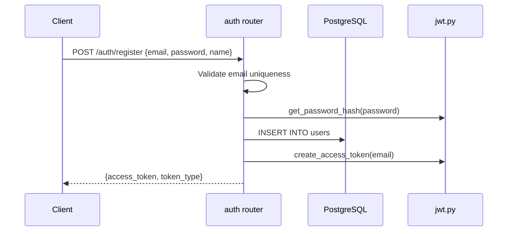
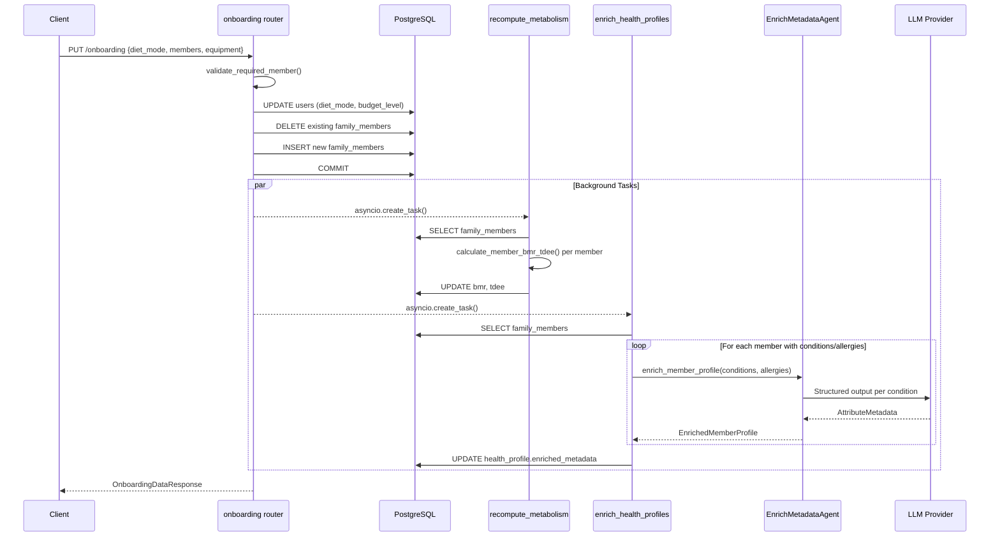
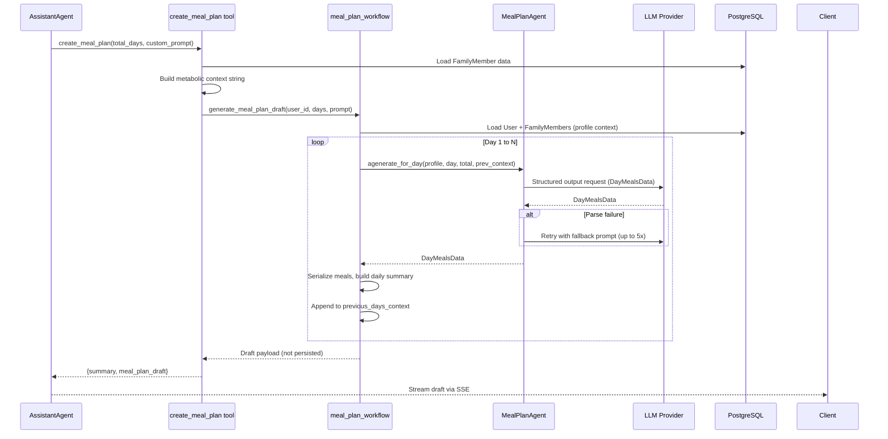
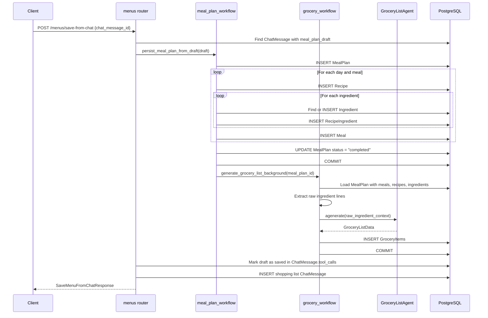
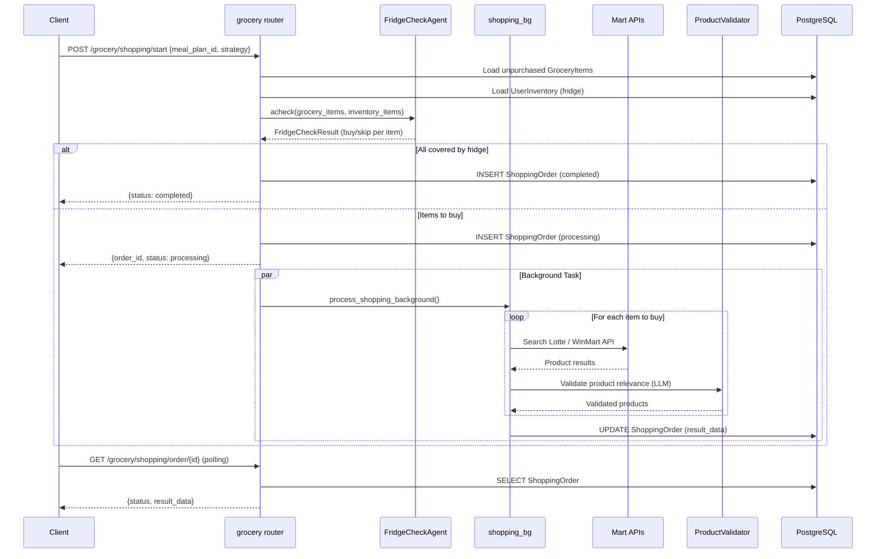
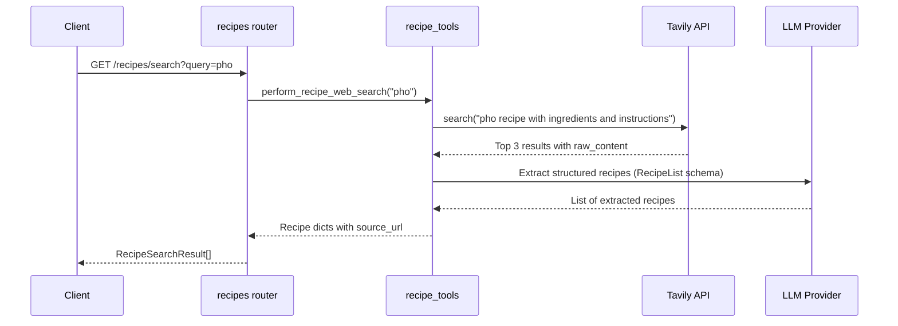

# Workflows

This document describes the end-to-end business workflows in the Nutri
backend: how data flows through agents, services, and the database for each
major feature.

## 1. User Registration and Authentication



## 2. Onboarding Flow

The onboarding flow persists user dietary preferences and household member
profiles, then triggers two background enrichment tasks.



### BMR/TDEE Calculation

Uses the Mifflin-St Jeor equation:
- Male: `10 * weight + 6.25 * height - 5 * age + 5`
- Female: `10 * weight + 6.25 * height - 5 * age - 161`

TDEE = BMR * activity multiplier:

| Level | Multiplier |
|---|---|
| sedentary | 1.2 |
| light | 1.375 |
| moderate | 1.55 |
| active | 1.725 |
| very_active | 1.9 |

## 3. Chat Streaming Flow

The chat flow is the central interaction pathway. It uses Server-Sent Events
(SSE) to stream agent responses in real time.

```mermaid
sequenceDiagram
    participant C as Client
    participant R as chat router
    participant DB as PostgreSQL
    participant Q as asyncio.Queue
    participant AA as AssistantAgent
    participant LG as LangGraph ReAct
    participant TOOLS as Tool Layer

    C->>R: POST /chat/stream {message, thread_id}
    R->>DB: Create/retrieve ChatSession
    R->>DB: INSERT ChatMessage (human)
    R->>R: is_meaningful_message()?

    alt Non-meaningful message
        R-->>C: SSE: init + fallback message + done
    else Meaningful message
        R->>Q: Create asyncio.Queue
        R-->>C: SSE: init {thread_id}

        par Background Agent Task
            R->>AA: bg_agent_task()
            AA->>LG: astream_events(message, config)

            loop ReAct Loop
                LG->>LG: Reason about next action
                alt Tool needed
                    LG->>TOOLS: Execute tool
                    LG-->>Q: tool_start event
                    TOOLS-->>LG: Tool result
                    LG-->>Q: tool_end event
                else Generate text
                    LG-->>Q: chunk events
                end
            end

            AA->>DB: persist_current_reply()
            AA-->>Q: persisted_message event
            AA-->>Q: done event
        end

        loop Stream Events
            C<<--R: SSE events from Queue
        end
    end
```

### Non-Meaningful Message Detection

The system filters out trivial inputs (greetings, single characters, emojis)
and returns a predefined helpful response instead of invoking the agent.
Language-specific fallbacks are provided for Vietnamese and English.

### Stream Error Recovery

If the agent stream fails due to invalid chat history or output parsing errors,
the system:
1. Sends a `retrying` event to the client.
2. Resets all partial state.
3. Creates a recovery thread ID (`{original_id}-recovery-{uuid}`).
4. Retries the stream once.

## 4. Meal Plan Generation Flow

This is the most complex workflow, spanning multiple agents and the
draft-then-persist pattern.

### 4.1 Draft Generation



**Draft Payload Structure:**

```json
{
  "draft_id": "uuid",
  "total_days": 3,
  "custom_prompt": "...",
  "name": "Menu Apr 02",
  "start_date": "2026-04-02",
  "end_date": "2026-04-04",
  "ai_context_summary": {"profile": "..."},
  "summary_markdown": "**Day 1**\n- ...",
  "days": [
    {
      "day_number": 1,
      "eat_date": "2026-04-02",
      "day_header": "Day 1 - 2 people - Targets: ...",
      "meals": [
        {
          "name": "Grilled Chicken Salad",
          "meal_type": "lunch",
          "calories": 450,
          "protein_grams": 35,
          "carbs_grams": 20,
          "fat_grams": 15,
          "ingredients": ["200g chicken breast", "100g mixed greens"],
          "instructions": ["Step 1...", "Step 2..."],
          "per_person_breakdown": ["Person 1: 450 kcal"],
          "adjustment_tips": ["Add avocado for healthy fats"],
          "why": "High protein, low carb meal suitable for weight management"
        }
      ]
    }
  ],
  "saved": false
}
```

### 4.2 Draft Persistence



### 4.3 Ingredient Parsing

The workflow includes robust ingredient parsing (`_parse_ingredient_entry`)
that handles multiple formats:

| Input Format | Example | Parsed Name | Parsed Grams |
|---|---|---|---|
| Leading weight | "200g chicken breast" | "chicken breast" | 200 |
| Trailing weight | "Chicken breast: 200g" | "Chicken breast" | 200 |
| Dict-like string | "{'name': 'Rice', 'grams': 300}" | "Rice" | 300 |
| Plain text | "Salt and pepper" | "Salt and pepper" | null |
| Kilogram unit | "1.5 kg rice" | "rice" | 1500 |

## 5. Grocery Shopping Flow

The shopping flow integrates the FridgeCheckAgent with mart API searches.



### Shopping Strategies

| Strategy | Behavior |
|---|---|
| `lotte_priority` | Search Lotte Mart first, fall back to WinMart |
| `winmart_priority` | Search WinMart first, fall back to Lotte Mart |
| `cost_optimized` | Search both, select cheapest option per item |

## 6. Recipe Search Flow



## 7. Background Task Summary

| Task | Trigger | Blocking | Agent Used |
|---|---|---|---|
| Recompute metabolism | Onboarding submit/update | No | None (pure calculation) |
| Enrich health profiles | Onboarding submit/update | No | EnrichMetadataAgent |
| Generate grocery list | Meal plan persistence | Configurable | GroceryListGeneratorAgent |
| Process shopping order | Shopping start | No | FridgeCheckAgent + Mart APIs |

All background tasks use `asyncio.create_task()` except the shopping order
which uses FastAPI's `BackgroundTasks` dependency.
