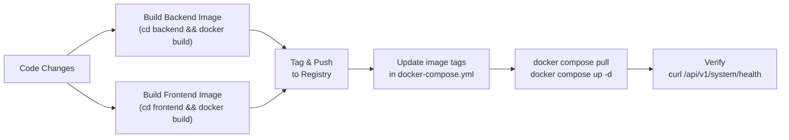

# Nutri -- Deployment Guide

This directory contains the production deployment configuration for the Nutri
platform. The entire stack (frontend, backend, database) is orchestrated via
a single Docker Compose file.

## Architecture

```
                    :80 (Frontend)          :8000 (Backend)
                   +--------------+        +-----------------+
  Browser -------> |    Nginx     |------->|    Gunicorn +    |-------> LLM API
                   | (static SPA) |  /api/ |  Uvicorn Workers |-------> Tavily
                   +--------------+        +-----------------+
                                                   |
                                           +-----------------+
                                           |  PostgreSQL 16  |
                                           |   (pgvector)    |
                                           +-----------------+
                                                   |
                                           +-----------------+
                                           |     pgweb       |
                                           |  (DB browser)   |
                                           +-----------------+
```

Nginx serves the React SPA and reverse-proxies `/api/*` requests to the
backend container. All services communicate over a Docker internal network.

## Services

| Service    | Image                           | Port (default) | Description                           |
| ---------- | ------------------------------- | -------------- | ------------------------------------- |
| `postgres` | `pgvector/pgvector:pg16`        | internal       | PostgreSQL 16 with pgvector extension |
| `pgweb`    | `sosedoff/pgweb`                | 8081           | Web-based database browser            |
| `backend`  | `<registry>/nutri-backend:tag`  | 8000           | FastAPI + Gunicorn (multi-worker)     |
| `frontend` | `<registry>/nutri-frontend:tag` | 80             | Nginx serving Vite build + API proxy  |

## Prerequisites

- Docker Engine or [Docker Desktop](https://www.docker.com/products/docker-desktop/)
- Access to a Docker registry (Docker Hub) for pushing/pulling images
- API keys: `GEMINI_API_KEY`, `TAVILY_API_KEY` (see Environment section)

---

## 1. Building Images

Images are built from the Dockerfiles in the `frontend/` and `backend/`
directories at the project root. Use a timestamp-based tag for versioning.

### 1.1 Backend Image

```bash
cd ../backend

docker build -t nutri-backend:latest .
```

**Build process:**

1. Base image: `python:3.12-slim`
2. Installs `uv` package manager from `ghcr.io/astral-sh/uv:latest`
3. Copies `pyproject.toml`, `uv.lock`, and `libs/` workspace members
4. Runs `uv sync --frozen --no-dev` (deterministic, production-only deps)
5. Copies application source (`src/`)
6. Copies `docker-entrypoint.sh` (DB init script)

**Entrypoint behavior:**

The entrypoint script runs on container start (before Gunicorn):

1. Waits 5 seconds for PostgreSQL readiness
2. Runs `Base.metadata.create_all` to ensure all tables exist
3. Hands off to the `command` defined in `docker-compose.yml`

### 1.2 Frontend Image

```bash
cd ../frontend

docker build -t nutri-frontend:latest .
```

**Build process (multi-stage):**

1. **Stage 1 -- Builder**: `node:20-alpine`
   - Runs `npm ci` (clean install from lockfile)
   - Runs `npm run build` (Vite production build to `/dist`)
2. **Stage 2 -- Serve**: `nginx:alpine`
   - Copies build artifacts from stage 1 to `/usr/share/nginx/html`
   - Copies `nginx.conf` for SPA routing and API proxy
   - Copies `env-config.sh` for runtime env injection

**Runtime env injection:**

Since Vite embeds `VITE_*` variables at build time, the frontend uses a
runtime injection script (`env-config.sh`) that generates
`/usr/share/nginx/html/env-config.js` on container start:

```js
window.ENV = {
  VITE_API_URL: "/api/v1",
  VITE_GOOGLE_CLIENT_ID: "...",
};
```

This allows changing API URL and OAuth credentials without rebuilding the image.

**Nginx configuration:**

```
/           -> Serve SPA (try_files $uri /index.html)
/api/*      -> Reverse proxy to http://backend:8000
```

Uses Docker's embedded DNS resolver (`127.0.0.11`) to handle startup race
conditions when the backend container is not yet available.

---

## 2. Pushing Images

Tag and push to your Docker Hub registry:

```bash
# Backend
docker tag nutri-backend:latest <your-registry>/nutri-backend:DDMMYYYY_HHMM
docker push <your-registry>/nutri-backend:DDMMYYYY_HHMM

# Frontend
docker tag nutri-frontend:latest <your-registry>/nutri-frontend:DDMMYYYY_HHMM
docker push <your-registry>/nutri-frontend:DDMMYYYY_HHMM
```

Tag format convention: `DDMMYYYY_HHMM` (e.g., `30032026_2359`).

After pushing, update the image tags in `docker-compose.yml`:

```yaml
backend:
  image: <your-registry>/nutri-backend:30032026_2359

frontend:
  image: <your-registry>/nutri-frontend:30032026_2300
```

---

## 3. Environment Configuration

Copy and edit the `.env` file before deploying:

```bash
cp .env .env.local   # or edit .env directly
```

### Required Variables

| Variable              | Description                              | Example                      |
| --------------------- | ---------------------------------------- | ---------------------------- |
| `GEMINI_API_KEY`      | API key for the LLM provider             | `your-api-key`               |
| `GEMINI_API_ENDPOINT` | Base URL for the LLM API                 | `http://cli2api.example.com` |
| `TAVILY_API_KEY`      | Tavily web search API key                | `tvly-dev-xxxxx`             |
| `SECRET_KEY`          | JWT signing secret (change from default) | random 32+ char string       |

### Database Variables

| Variable            | Default    | Description            |
| ------------------- | ---------- | ---------------------- |
| `POSTGRES_USER`     | `postgres` | PostgreSQL user        |
| `POSTGRES_PASSWORD` | `password` | PostgreSQL password    |
| `POSTGRES_DB`       | `nutri`    | Database name          |
| `POSTGRES_PORT`     | `5432`     | Internal database port |

### LLM Configuration

| Variable       | Default  | Description                    |
| -------------- | -------- | ------------------------------ |
| `LLM_PROVIDER` | `openai` | `"openai"` or `"gemini"`       |
| `MODEL_NAME`   | --       | Model name (e.g., `qwen3-max`) |
| `TEMPERATURE`  | `0.5`    | LLM sampling temperature       |

### Service Ports

| Variable        | Default | Description                 |
| --------------- | ------- | --------------------------- |
| `FRONTEND_PORT` | `80`    | Frontend (Nginx) host port  |
| `BACKEND_PORT`  | `8000`  | Backend API host port       |
| `PGWEB_PORT`    | `8081`  | pgweb database browser port |

### Application Variables

| Variable           | Default      | Description                     |
| ------------------ | ------------ | ------------------------------- |
| `ENVIRONMENT`      | `production` | Runtime environment flag        |
| `BACKEND_WORKERS`  | `2`          | Gunicorn worker count           |
| `GOOGLE_CLIENT_ID` | --           | Google OAuth client ID          |
| `API_URL`          | `/api/v1`    | API path injected into frontend |

---

## 4. Deploying

### Start the stack

```bash
cd deploy
docker compose up -d
```

This pulls images (if not local), creates containers, and starts all services.

### Verify

```bash
# Check all containers are running
docker compose ps
```

### View logs

```bash
# All services
docker compose logs -f

# Single service
docker compose logs -f backend
docker compose logs -f frontend
docker compose logs -f postgres
```

### Stop the stack

```bash
docker compose down
```

### Stop and remove data volumes

```bash
docker compose down -v
```

This removes the PostgreSQL data volume. All data will be lost.

---

## 5. Updating

To deploy a new version:

### 5.1 Build new images

```bash
# From project root
cd backend && docker build -t nutri-backend:latest .
cd ../frontend && docker build -t nutri-frontend:latest .
```

### 5.2 Tag and push

```bash
docker tag nutri-backend:latest <your-registry>/nutri-backend:<tag>
docker push <your-registry>/nutri-backend:<tag>

docker tag nutri-frontend:latest <your-registry>/nutri-frontend:<tag>
docker push <your-registry>/nutri-frontend:<tag>
```

### 5.3 Update compose file

Edit `docker-compose.yml` with new image tags:

```yaml
backend:
  image: <your-registry>/nutri-backend:<tag>
frontend:
  image: <your-registry>/nutri-frontend:<tag>
```

### 5.4 Deploy

```bash
cd deploy
docker compose pull
docker compose up -d
```

Docker Compose will recreate only the containers with changed images.

---

## 6. Deployment Workflow Summary



## 7. Troubleshooting

| Symptom                       | Cause                       | Solution                                       |
| ----------------------------- | --------------------------- | ---------------------------------------------- |
| Backend crashes on startup    | Database not ready          | Entrypoint has 5s sleep; increase if needed    |
| `502 Bad Gateway` on `/api/*` | Backend not yet running     | Wait for backend to finish DB init             |
| Frontend shows blank page     | Nginx misconfigured         | Check `nginx.conf` try_files directive         |
| Google login fails            | Missing `GOOGLE_CLIENT_ID`  | Set in `.env` and restart frontend             |
| LLM errors                    | Invalid API key or endpoint | Verify `GEMINI_API_KEY`, `GEMINI_API_ENDPOINT` |
| DB connection refused         | Wrong credentials or port   | Check `POSTGRES_*` vars match across services  |
| pgweb not accessible          | Port conflict               | Change `PGWEB_PORT` in `.env`                  |

## 8. Data Persistence

PostgreSQL data is persisted in a named Docker volume: `postgres_prod_data`.

- Data survives `docker compose down` (without `-v` flag).
- Data is destroyed by `docker compose down -v`.
- To backup: `docker exec nutri_prod_postgres pg_dump -U postgres nutri > backup.sql`
- To restore: `cat backup.sql | docker exec -i nutri_prod_postgres psql -U postgres nutri`
